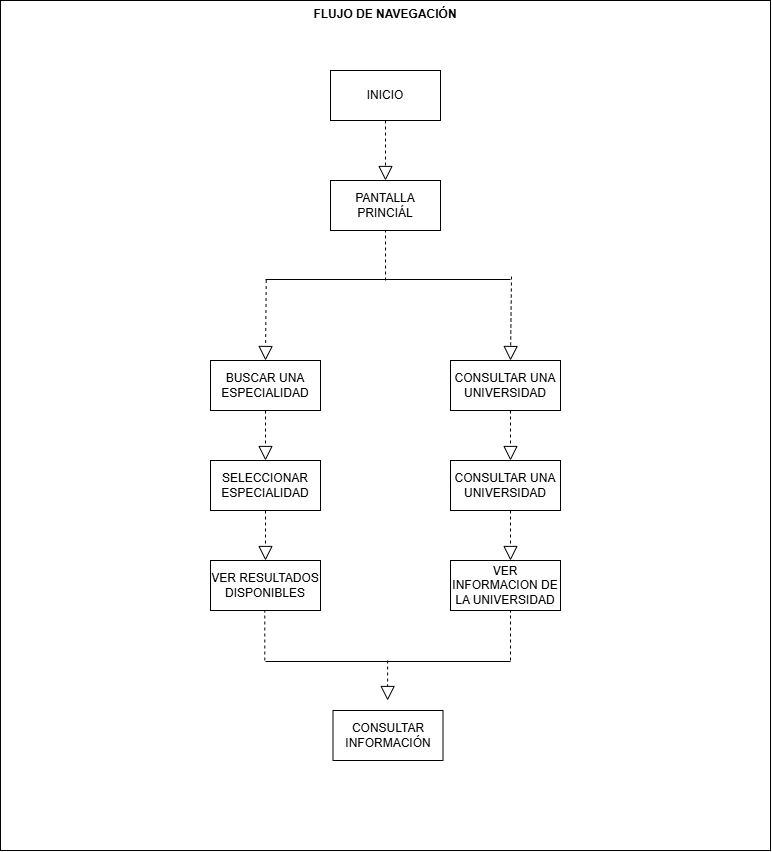
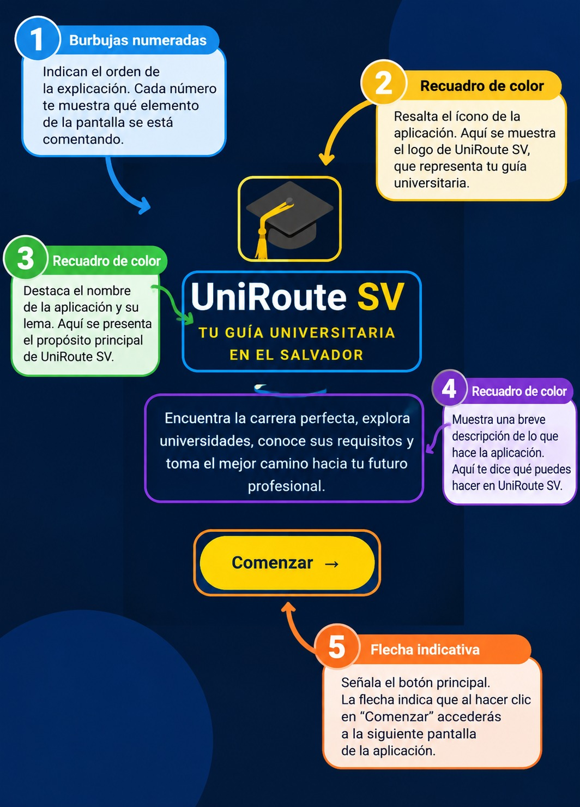

# Guía Visual de Navegación y Uso de la Aplicación UniRoute
Bienvenido a la guía de uso de **UniRoute SV 2026**, una aplicación diseñada para ayudar a los estudiantes de bachillerato a explorar diferentes especialidades profesionales y conocer las universidades de El Salvador donde pueden continuar sus estudios.

Este manual explica paso a paso cómo navegar por la aplicación, seleccionar áreas de interés y consultar la información académica de las instituciones disponibles.

---

## 1. Mapa General de Navegación
A continuación, se presenta el recorrido general de las pantallas de UniRoute, desde la pantalla de inicio hasta la consulta de las especialidades y la información de las universidades.

La navegación permite al usuario explorar las opciones disponibles, seleccionar una especialidad y consultar los datos de las universidades relacionadas con sus intereses académicos.

---

## 2. Pantalla de Inicio de UniRoute
Al abrir la aplicación, se muestra la pantalla de bienvenida de UniRoute SV 2026, que permite al usuario ingresar al directorio académico y comenzar a explorar las opciones disponibles.

1. **Nombre de la aplicación:** Identifica el sistema como UniRoute SV 2026.
2. **Acceso al directorio académico:** Permite ingresar a las opciones de consulta de la aplicación.
3. **Navegación principal:** Facilita el acceso a las secciones disponibles para explorar especialidades y universidades.

---

## 3. Exploración de Especialidades Profesionales
UniRoute permite explorar diferentes áreas profesionales para que los estudiantes identifiquen opciones relacionadas con sus intereses y aspiraciones académicas.

1. **Selección de especialidad:** Elige el área profesional que deseas conocer.
2. **Filtrado de información:** Utiliza las categorías disponibles para visualizar las opciones relacionadas con la especialidad seleccionada.
3. **Consulta de carreras:** Revisa las carreras y los tipos de formación disponibles dentro de cada área.
4. **Comparación de opciones:** Explora las alternativas académicas que pueden ayudarte a decidir qué estudiar.

Entre las áreas disponibles se encuentran Gastronomía, Medicina, Leyes, Idiomas, Aeronáutica, Automotriz, Administración y Tecnología.

---

## 4. Consulta de Universidades
Después de explorar las especialidades, el usuario puede consultar las instituciones educativas incluidas en el directorio de UniRoute.

1. **Listado de universidades:** Explora las instituciones disponibles en la aplicación.
2. **Selección de una universidad:** Elige la institución sobre la que deseas obtener más información.
3. **Consulta de carreras:** Revisa la carrera o especialidad asociada con la institución.
4. **Revisión de la modalidad y duración:** Consulta los datos disponibles sobre la modalidad de estudio y el tiempo de formación.
5. **Información de ubicación:** Identifica el departamento, municipio o dirección registrada de la institución.

Esta función facilita la búsqueda de alternativas educativas de acuerdo con los intereses y las necesidades del estudiante.

---

## 5. Consulta de Información y Contacto
UniRoute reúne información útil para que los estudiantes conozcan mejor las instituciones educativas y puedan investigar sus opciones de formación.

1. **Nombre de la institución:** Identifica la universidad o centro educativo seleccionado.
2. **Carrera y tipo de formación:** Consulta la información académica disponible, incluyendo si la formación es técnica o de ingeniería cuando corresponda.
3. **Ubicación y dirección:** Revisa los datos de localización de la institución.
4. **Información de contacto:** Consulta el número telefónico y los medios de contacto registrados.
5. **Sitio web:** Si está disponible, utiliza el enlace para obtener información adicional directamente de la institución.
6. **Beneficios y comodidades:** Revisa los servicios, las comodidades y la información sobre becas que se encuentre registrada.

**Nota:** La disponibilidad y exactitud de estos datos dependen de la información incorporada en el directorio de UniRoute.

---

## 6. Video Tutorial de UniRoute
En esta sección se presenta un video tutorial que permite observar el funcionamiento de la aplicación y comprender cómo utilizar sus principales herramientas.

El video muestra el proceso de navegación por UniRoute, la exploración de las especialidades profesionales y la consulta de la información de las universidades.

**Video tutorial de UniRoute:**

[Ver video tutorial de UniRoute](videos/videotutorial_proyecto.mp4)

---

## 7. Recomendaciones para el Usuario
- Explora diferentes especialidades antes de elegir una carrera.
- Revisa la información de varias instituciones educativas para conocer las alternativas disponibles.
- Verifica directamente con la universidad los requisitos de ingreso, los costos y los planes de estudio.
- Utiliza los datos de contacto y los sitios web disponibles para ampliar la información.
- Considera tus intereses, habilidades y metas profesionales al tomar una decisión académica.

---

## 8. Conclusión
UniRoute SV 2026 es una herramienta de orientación académica que facilita la exploración de especialidades profesionales y la consulta de universidades de El Salvador. Mediante su directorio, los estudiantes pueden conocer diferentes alternativas educativas, revisar información relevante y contar con una referencia para tomar decisiones sobre su futuro académico y profesional.